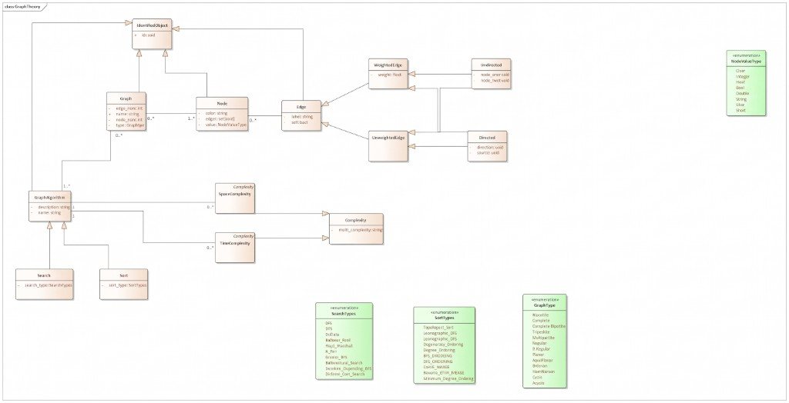

# Software Architecture for Controlling Smart Grids

This repository is **Part 2** of a two-part project on SPARQL, RDF modelling, and querying knowledge graphs.

| Part | Repository | Role |
|------|------------|------|
| **1** | [dusanparipovic/sparql-playground](https://github.com/dusanparipovic/sparql-playground) | Interactive SPARQL learning environment (fork of [SIB SPARQL Playground](https://github.com/calipho-sib/sparql-playground)) with local RDF scenarios |
| **2** | *this repository* | Jupyter notebooks that run SPARQL against public endpoints (DBpedia), with raw SPARQL and SPARQL-Burger builders |

Together, Part 1 teaches SPARQL on a controlled graph-theory ontology; Part 2 applies the same skills to real-world Linked Open Data.

---

## Part 1 - SPARQL Playground (Graph Theory ontology)

- My SPARQL Playground fork which you could use to query my own existing ontology: [https://github.com/dusanparipovic/sparql-playground](https://github.com/dusanparipovic/sparql-playground)

The playground ships with several RDF scenarios. The **graph theory** scenario models graphs, nodes, edges, algorithms, and complexity measures. Use `start-graphtheory.bat` / the graphtheory data directory from the fork to load that scenario.

### Class diagram — system used inside SPARQL Playground

The diagram below is the UML model of the **GraphTheory** ontology used as the playground dataset (`Graph`, `Node`, `Edge`, algorithms, and complexity types):



Core ideas from the model:

- Everything identifiable inherits from `IdentifiedObject` (`id: uuid`)
- A `Graph` contains `Node`s and may relate to `GraphAlgorithm`s
- Edges specialise into weighted / unweighted and directed / undirected forms
- Algorithms (`Search`, `Sort`) are linked to `TimeComplexity` and `SpaceComplexity`

---

## Part 2 — This repository (public SPARQL endpoints)

### Notebooks

| Notebook | Description |
|----------|-------------|
| [`additional-queries/dbpedia/dbpedia.ipynb`](additional-queries/dbpedia/dbpedia.ipynb) | Sample queries as raw SPARQL strings |
| [`additional-queries/dbpedia/dbpedia-sparql-burger.ipynb`](additional-queries/dbpedia/dbpedia-sparql-burger.ipynb) | Same queries built with [SPARQL-Burger](http://pmitzias.com/SPARQLBurger) |

Both notebooks share helpers to run SELECT queries, retry transient DBpedia errors, and display Polars tables with shortened URLs.

### Setup

Requires Python **3.11+** and [uv](https://docs.astral.sh/uv/).

```bash
# Install dependencies (creates .venv)
uv sync

# Register the kernel / open notebooks
uv run jupyter lab
# or
uv run jupyter notebook
```

Then open either notebook under `additional-queries/dbpedia/`, run the **setup** cell first, and execute the query cells.

### Endpoint

Queries target the public DBpedia SPARQL service:

- Endpoint: `https://dbpedia.org/sparql`
- UI: [https://dbpedia.org/sparql](https://dbpedia.org/sparql)

The public endpoint can return HTTP 429/503 under load, the notebooks retry those responses automatically.

---

## Project relationship

```text
Part 1: SPARQL Playground          Part 2: Smart-grids SPARQL notebooks
(github.com/dusanparipovic/        (this repository)
 sparql-playground)
┌─────────────────────────┐        ┌──────────────────────────────────┐
│ Local RDF scenarios     │        │ Queries against DBpedia          │
│ GraphTheory ontology    │  ──►   │ Raw SPARQL + SPARQL-Burger       │
│ Learn SPARQL interactively│      │ Jupyter + Polars results         │
└─────────────────────────┘        └──────────────────────────────────┘
```